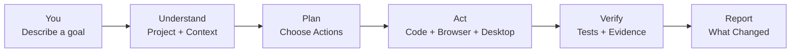
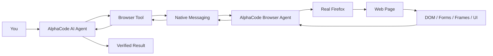
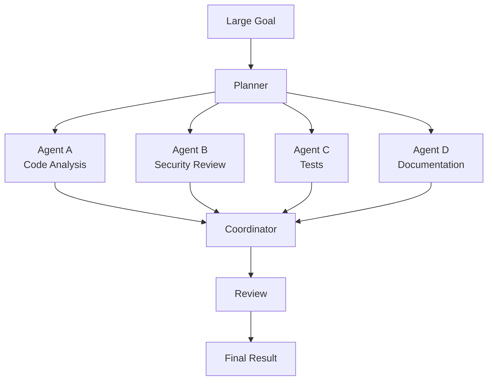
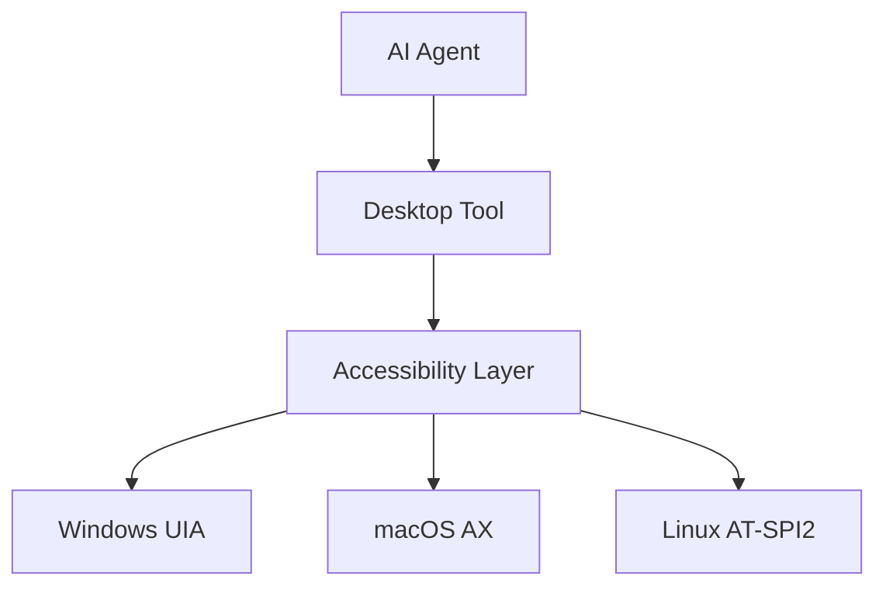

<div align="center">


<br>

<h1>Build. Browse. Automate. Verify.</h1>

<p>
  <strong>AlphaCode is a free, open-source AI coding agent that can understand your project, write code, use your browser, control your desktop, run commands, test changes, and work through complex tasks for you.</strong>
</p>

<p>
  From a simple question like <code>fix this bug</code> to a complete workflow involving your codebase, Firefox, websites, APIs, files, and desktop applications — AlphaCode is designed to turn natural-language instructions into real actions.
</p>

<br>

<p>
  <a href="https://github.com/dragonked2/alphacode">
    
  </a>
  <a href="https://github.com/dragonked2/alphacode/releases">
    
  </a>
  <a href="https://github.com/dragonked2/alphacode/blob/main/LICENSE">
    
  </a>
  <a href="https://github.com/dragonked2/alphacode/issues">
    
  </a>
</p>

<p>
  
  
  
  
  
  
</p>

<br>

<a href="https://github.com/dragonked2/alphacode">
  
</a>
&nbsp;
<a href="https://addons.mozilla.org/en-US/firefox/addon/alphacode-browser-agent/">
  
</a>

<br><br>

<a href="#-what-is-alphacode">What is AlphaCode?</a> · <a href="#-browser-agent">Browser Agent</a> · <a href="#-quick-start">Quick Start</a> · <a href="#-features">Features</a> · <a href="#-benchmarks">Benchmarks</a> · <a href="#-desktop-control">Desktop Control</a> · <a href="#-install">Install</a> · <a href="#-faq">FAQ</a>

</div>

---

# 🤖 What is AlphaCode?

**AlphaCode is an open-source AI coding agent built to do more than generate text.**

Instead of only answering questions about your code, AlphaCode can operate inside your development environment and use tools to complete real tasks.

You describe what you want.

AlphaCode investigates.

It plans.

It changes files.

It runs commands.

It uses the web.

It can operate a real Firefox browser.

It can interact with desktop applications.

It can run tests.

It reviews its work.

Then it tells you what happened.



### The important difference

AlphaCode is designed as an **execution-oriented AI agent**.

It is not simply:

```text
You → AI → Text
```

It is closer to:

```text
You
 ↓
AlphaCode Agent
 ↓
Understand → Plan → Execute → Observe → Verify
 ↓
Code + Terminal + Web + Firefox + Desktop + Tools
 ↓
Verified result
```

That means you can give it tasks such as:

```text
Find why the application crashes when users upload a PDF.
Fix the root cause.
Add a regression test.
Run the test suite.
Review the final diff.
```

Or:

```text
Open the website in Firefox.
Log in using the existing browser session.
Find the account settings page.
Check whether the new feature is visible.
Take a screenshot and report the result.
```

Or:

```text
Audit this project for security problems.
Trace suspicious input flows.
Identify realistic attack paths.
Validate the important findings.
Explain which findings are actually reproducible.
```

The agent is designed to **work through the task**, rather than simply describe how a human could do it.

---

# 🌐 Meet the AlphaCode Browser Agent

The **AlphaCode Browser Agent** is the bridge between AlphaCode and a real Firefox browser.

It gives AlphaCode the ability to work with an actual browser session instead of treating the web as nothing more than a collection of HTTP responses.

### Install the Firefox extension

**[Install AlphaCode Browser Agent from Firefox Add-ons](https://addons.mozilla.org/en-US/firefox/addon/alphacode-browser-agent/)**

Once the extension and AlphaCode are configured, the agent can interact with browser environments through the AlphaCode browser integration.



## What makes the Browser Agent useful?

A normal HTTP client can request a page.

A browser agent can **experience the page as a browser**.

That difference matters.

The AlphaCode Browser Agent is intended for workflows involving:

* JavaScript-heavy websites
* Dynamic interfaces
* DOM inspection
* Forms and inputs
* Buttons and interactive controls
* Multiple browser tabs
* Frames and embedded content
* Existing authenticated browser sessions
* Scrolling
* Browser navigation
* Screenshots
* Downloads
* Browser-based testing
* Web application debugging
* QA workflows
* Security testing
* Repetitive browser tasks
* Agent-driven web workflows

### Example

Instead of telling an AI:

> "Here is the HTML. Tell me what I should click."

You can build a workflow where AlphaCode can reason about the live browser environment and perform the appropriate browser actions.

```text
User
 │
 ├─ "Open the application"
 │
 ├─ "Check the login flow"
 │
 ├─ "Navigate to the dashboard"
 │
 ├─ "Test the form validation"
 │
 └─ "Report anything suspicious"
 │
 ▼
AlphaCode
 │
 ├─ Browser navigation
 ├─ Page inspection
 ├─ DOM interaction
 ├─ Form interaction
 ├─ State observation
 ├─ Screenshots
 └─ Verification
 │
 ▼
Structured result
```

---

# 🦊 AlphaCode Browser Agent for Firefox

The Firefox extension is the browser-side component of AlphaCode's browser automation architecture.

**Get it here:**

**[Mozilla Firefox Add-ons — AlphaCode Browser Agent](https://addons.mozilla.org/en-US/firefox/addon/alphacode-browser-agent/)**

The extension communicates with the local AlphaCode application through Firefox's native messaging architecture.

This allows the browser to act as an execution environment for the AI agent while AlphaCode remains the orchestration and reasoning layer.

### Architecture

```text
┌─────────────────────────────┐
│           YOU               │
│      Natural Language       │
└──────────────┬──────────────┘
               │
               ▼
┌─────────────────────────────┐
│        ALPHACODE            │
│       AI Agent Core         │
└──────────────┬──────────────┘
               │
       Browser Tool
               │
               ▼
┌─────────────────────────────┐
│     Native Messaging        │
└──────────────┬──────────────┘
               │
               ▼
┌─────────────────────────────┐
│  ALPHACODE BROWSER AGENT    │
│       Firefox Extension     │
└──────────────┬──────────────┘
               │
               ▼
┌─────────────────────────────┐
│       REAL FIREFOX          │
│                             │
│  Tabs • Pages • DOM • UI    │
│  Forms • Frames • Downloads │
└─────────────────────────────┘
```

---

# 🧠 Why AlphaCode?

AlphaCode combines several capabilities that normally require separate tools.

| Capability                      | AlphaCode |
| ------------------------------- | :-------: |
| AI coding agent                 |     ✅     |
| Autonomous task execution       |     ✅     |
| Natural-language commands       |     ✅     |
| File editing                    |     ✅     |
| Terminal / shell                |     ✅     |
| Web search                      |     ✅     |
| Web fetching                    |     ✅     |
| Real Firefox browser automation |     ✅     |
| Browser DOM interaction         |     ✅     |
| Desktop automation              |     ✅     |
| Multi-agent Swarm Mode          |     ✅     |
| Persistent sessions             |     ✅     |
| Project memory                  |     ✅     |
| MCP                             |     ✅     |
| Security-oriented workflows     |     ✅     |
| Built-in skills                 |     ✅     |
| 40+ tools                       |     ✅     |
| Multiple AI providers           |     ✅     |
| Free AI lane                    |     ✅     |
| Windows                         |     ✅     |
| macOS                           |     ✅     |
| Linux                           |     ✅     |

---

# ✨ Built for Humans, Not Just Developers

You do not need to learn a complicated agent framework before using AlphaCode.

Start with what you want to accomplish.

### Instead of this:

```text
I need to inspect src/auth/controller.rs,
trace the request lifecycle,
identify the failing branch,
modify the relevant implementation,
execute cargo test,
and inspect the resulting diff.
```

You can simply say:

```text
Find and fix the authentication bug.
Test the fix and show me what changed.
```

AlphaCode handles the workflow.

### Simple requests

```text
Explain this project.
```

```text
Fix the error I'm getting.
```

```text
Make this page look better.
```

```text
Find the security problems in this application.
```

```text
Run the tests and fix whatever is broken.
```

```text
Open the website in Firefox and test the login form.
```

### More advanced requests

```text
Audit the authentication system for vulnerabilities,
trace user-controlled input to sensitive operations,
validate realistic findings,
fix the confirmed issues,
and add regression tests.
```

The interface grows with you.

**Beginners can start with plain English.**

**Developers can use precise technical instructions.**

**Power users can orchestrate multiple agents and tools.**

---

# 🚀 Quick Start

## 1. Install AlphaCode

### Windows

```powershell
iwr -useb https://raw.githubusercontent.com/dragonked2/alphacode/main/scripts/install.ps1 | iex
```

### macOS / Linux

```bash
curl -fsSL https://raw.githubusercontent.com/dragonked2/alphacode/main/scripts/install.sh | bash
```

Then:

```bash
alphacode
```

No API key is required to begin using the built-in free AI lane.

---

# 🦊 2. Connect Firefox

Install:

**[AlphaCode Browser Agent for Firefox](https://addons.mozilla.org/en-US/firefox/addon/alphacode-browser-agent/)**

Then configure the AlphaCode browser integration:

```bash
alphacode browser setup
```

Check the connection:

```bash
alphacode browser status
```

A healthy setup should report that the browser bridge is available and responding.

---

# 🔐 Signing in with a provider

Most providers work from an environment variable (`ANTHROPIC_API_KEY`,
`OPENAI_API_KEY`, and so on). Run `/login` inside AlphaCode for the
interactive flows.

**OpenAI (Codex OAuth)** is the exception: it needs a local callback listener, so
AlphaCode serves the redirect on `http://localhost:1455/auth/callback` while you
sign in. Make sure port `1455` on localhost is free, and that nothing else is
listening on it, before you start. If login fails with a timeout, something is
already bound to that port — stop it and run `/login` again.

See [OAUTH.md](OAUTH.md) for the full set of provider flows and troubleshooting.

---

# ⚡ 3. Give AlphaCode a task

You don't need special syntax.

Try:

```text
Explain this project and identify the main entry points.
```

Then:

```text
Find the biggest bugs and explain them.
```

Then:

```text
Fix the highest-impact bug and run the tests.
```

For browser workflows:

```text
Open the application in Firefox and inspect the login flow.
```

Or:

```text
Open the website, test the registration form,
and report validation problems.
```

---

# 🧰 What AlphaCode Can Actually Do

## 📁 Work with your code

AlphaCode can:

* Read files
* Create files
* Edit existing code
* Apply patches
* Search repositories
* Trace code paths
* Understand project structure
* Run tests
* Run build systems
* Execute commands
* Review diffs
* Diagnose errors

---

## 🌐 Work with the web

AlphaCode can combine web tools with browser automation.

It can:

* Search the web
* Fetch pages
* Inspect web content
* Navigate real browser sessions
* Interact with web applications
* Work with forms
* Inspect DOM structures
* Handle dynamic pages
* Work with browser state
* Capture screenshots
* Assist with QA
* Assist with security testing

---

## 🖥 Control desktop applications

AlphaCode also supports native desktop automation.

It can discover applications, inspect accessibility trees, find controls, click elements, type text, press keys, scroll, focus applications, and capture screenshots.

Supported accessibility backends include:

| Platform | Technology        |
| -------- | ----------------- |
| Windows  | UI Automation     |
| macOS    | Accessibility API |
| Linux    | AT-SPI2           |

This makes AlphaCode useful beyond websites.

For example:

```text
Open Calculator.
Calculate 123 × 456.
Read the result.
```

The agent can use the desktop environment to complete the workflow.

---

# 🐝 Swarm Mode

Large tasks can be divided into smaller tasks and handled by multiple agents.



Example:

```text
/swarm "Analyze this application from architecture,
security, testing, and performance perspectives."
```

Swarm Mode is designed for tasks that can be meaningfully decomposed into independent or semi-independent work.

---

# 🧠 Memory and Persistent Sessions

Long-running work should not disappear because a terminal closed.

AlphaCode supports persistent sessions so you can continue previous work.

```bash
alphacode sessions list
```

Resume:

```bash
alphacode --resume
```

Or resume a specific session:

```bash
alphacode --resume <id>
```

This is particularly useful for:

* Large codebases
* Security assessments
* Long debugging sessions
* Multi-stage development
* Research
* Browser workflows
* Large refactors

---

# 🔌 Bring Your Own AI

AlphaCode is designed to be model-agnostic.

You can start with the built-in free AI lane and later connect additional providers.

Depending on the available integrations, AlphaCode supports providers and OpenAI-compatible services such as:

* Anthropic / Claude
* OpenAI / GPT
* Google Gemini
* GitHub Copilot
* Cursor
* OpenRouter
* AWS Bedrock
* Azure
* OpenAI-compatible APIs
* Self-hosted model endpoints

List providers:

```bash
alphacode provider list
```

Show the current provider:

```bash
alphacode provider current
```

List models:

```bash
alphacode model list
```

Change models:

```bash
alphacode model use <model>
```

Inside the TUI:

```text
Ctrl+T
```

opens the model/provider selector.

---

# 🛠 40+ Built-in Tools

AlphaCode provides a broad toolset so the agent can move from reasoning to execution.

### Files

| Tool          | Purpose                 |
| ------------- | ----------------------- |
| `read`        | Read files              |
| `write`       | Create or replace files |
| `edit`        | Make targeted changes   |
| `multiedit`   | Apply multiple edits    |
| `patch`       | Apply patches           |
| `apply_patch` | Apply unified diffs     |
| `ls`          | Inspect directories     |

### Search & Analysis

| Tool                  | Purpose                     |
| --------------------- | --------------------------- |
| `agentgrep`           | Code-aware search           |
| `session_search`      | Search previous sessions    |
| `conversation_search` | Search conversation history |

### Execution

| Tool    | Purpose                |
| ------- | ---------------------- |
| `bash`  | Execute shell commands |
| `batch` | Run multiple actions   |
| `bg`    | Background execution   |

### Web & Browser

| Tool        | Purpose                 |
| ----------- | ----------------------- |
| `browser`   | Real browser automation |
| `webfetch`  | Fetch web content       |
| `websearch` | Search the web          |
| `scrapling` | Advanced scraping       |
| `httpflow`  | HTTP analysis           |
| `open`      | Open files and URLs     |

### Desktop

| Tool                 | Purpose                           |
| -------------------- | --------------------------------- |
| `desktop`            | Cross-platform desktop automation |
| `macos_computer_use` | macOS computer control            |

### Agent Intelligence

| Tool         | Purpose                    |
| ------------ | -------------------------- |
| `memory`     | Persistent project context |
| `initiative` | Track larger objectives    |
| `todo`       | Manage tasks               |
| `plan`       | Plan complex work          |
| `swarm`      | Coordinate multiple agents |

### Utilities

| Tool             | Purpose                        |
| ---------------- | ------------------------------ |
| `doctor`         | Diagnose installation problems |
| `self_improve`   | Agent improvement workflows    |
| `selfdev`        | Development workflows          |
| `cron`           | Scheduled tasks                |
| `schedule`       | Ambient scheduling             |
| `jwt`            | JWT parsing                    |
| `clipboard`      | Clipboard operations           |
| `side_panel`     | Side-panel output              |
| `discover_tools` | Discover integrations          |

---

# 🎓 Skills

AlphaCode can extend its behavior through reusable skills.

Examples include:

```text
/bugbounty
/meme-coin-audit
/frontend-design
```

Browse available skills:

```text
/skills
```

This lets AlphaCode become specialized for different workflows without changing the core agent.

---

# 📊 Benchmarks

Performance matters when an agent is running continuously.

AlphaCode is written in Rust and is designed to keep its runtime footprint relatively small.

The following figures are **historical benchmark snapshots** retained for reproducibility. They are not a guarantee of current performance across every machine, operating system, workload, or software version.

## Memory Usage — One Active Session

| Tool               |         RAM | Relative to AlphaCode |
| ------------------ | ----------: | --------------------: |
| **AlphaCode**      | **27.8 MB** |              **1.0×** |
| Codex CLI          |    140.0 MB |                  5.0× |
| pi                 |    144.4 MB |                  5.2× |
| Cursor Agent       |    214.9 MB |                  7.7× |
| Antigravity CLI    |    243.7 MB |                  8.8× |
| GitHub Copilot CLI |    333.3 MB |                 12.0× |
| OpenCode           |    371.5 MB |                 13.4× |
| Claude Code        |    386.6 MB |                 13.9× |

## Memory Usage — Ten Concurrent Sessions

| Tool               |          RAM | Relative to AlphaCode |
| ------------------ | -----------: | --------------------: |
| **AlphaCode**      | **117.0 MB** |              **1.0×** |
| Codex CLI          |     334.8 MB |                  2.9× |
| pi                 |     833.0 MB |                  7.1× |
| Antigravity CLI    |   1,021.2 MB |                  8.7× |
| Cursor Agent       |   1,632.4 MB |                 14.0× |
| GitHub Copilot CLI |   1,756.5 MB |                 15.0× |
| Claude Code        |   2,300.6 MB |                 19.7× |
| OpenCode           |   3,237.2 MB |                 27.7× |

### Reproducing the benchmarks

For meaningful comparisons, record:

1. AlphaCode version or commit
2. Operating system
3. CPU and RAM
4. Build profile
5. Enabled features
6. Number of active sessions
7. Measurement method
8. Warm/cold state
9. Exact workload

Benchmarks can vary significantly with workloads and runtime conditions.

**Do not treat these numbers as a universal performance ranking.**

---

# 🛡 Safety by Design

An agent that can execute actions needs safeguards.

AlphaCode includes protections around potentially destructive operations.

Safety mechanisms include:

* Destructive filesystem/device targets can be blocked.
* Risky actions can require explicit permission.
* Shell execution passes through safety controls.
* Network operations can apply SSRF and credential-leak heuristics.
* Interrupted sessions are tracked rather than silently discarded.
* Desktop automation has action timeouts.
* Desktop operations include emergency-stop handling.
* Input state is cleaned up when operations fail.
* Browser and desktop data should be treated as potentially untrusted.

**AI agents can make mistakes.**

Always review important changes before deploying them to production systems.

Review your changes with:

```text
/diff
```

---

# 🧪 Security Testing & Bug Bounty Workflows

AlphaCode can also be useful for authorized security research.

Its combination of:

```text
Code Analysis
      +
HTTP/Web Tools
      +
Browser Automation
      +
Terminal Execution
      +
Memory
      +
Multi-Agent Workflows
```

makes it possible to build repeatable security-testing workflows.

Examples:

```text
Analyze this application for authentication weaknesses.
```

```text
Review the API for insecure direct object references.
```

```text
Trace this parameter through the application
and determine whether it reaches a dangerous sink.
```

```text
Open the authorized test environment in Firefox,
test the input validation,
and document reproducible findings.
```

Use AlphaCode only against systems and environments you are authorized to test.

---

# 🖥 Desktop Control

AlphaCode can interact with native applications using accessibility APIs rather than relying exclusively on screen coordinates.



Typical actions include:

```text
list_windows
snapshot
find
click
type
press
scroll
focus
screenshot
toggle
expand
collapse
```

Example:

```text
User:
Open Calculator and calculate 123 * 456.

AlphaCode:
→ Find Calculator
→ Inspect accessibility tree
→ Locate calculator controls
→ Enter expression
→ Read result
→ Report 56088
```

---

# 🧩 MCP Support

AlphaCode supports the Model Context Protocol ecosystem, allowing additional tools and services to be connected to the agent.

This makes the architecture extensible:

```text
AlphaCode
   │
   ├── Built-in Tools
   ├── Browser
   ├── Desktop
   ├── Skills
   ├── Swarm
   └── MCP
          │
          ├── External Tools
          ├── Services
          └── Custom Integrations
```

The result is an agent that can grow beyond its built-in capabilities.

---

# 🚀 Installation

## Windows

```powershell
iwr -useb https://raw.githubusercontent.com/dragonked2/alphacode/main/scripts/install.ps1 | iex
```

The installer can:

* Detect the CPU architecture
* Download the latest release
* Verify SHA-256 checksums
* Install `alphacode.exe`
* Add AlphaCode to your user PATH (opt-in, see below)
* Run without administrator privileges

Pin a version:

```powershell
iwr -useb https://raw.githubusercontent.com/dragonked2/alphacode/main/scripts/install.ps1 | iex -Version vX.Y.Z
```

Build from source:

```powershell
iwr -useb https://raw.githubusercontent.com/dragonked2/alphacode/main/scripts/install.ps1 | iex -FromSource
```

Add to your user PATH:

```powershell
iwr -useb https://raw.githubusercontent.com/dragonked2/alphacode/main/scripts/install.ps1 | iex -AddPath
```

Preview what `-AddPath` would change, without writing anything:

```powershell
iwr -useb https://raw.githubusercontent.com/dragonked2/alphacode/main/scripts/install.ps1 | iex -AddPath -PathDryRun
```

`-AddPath` is conservative by design: it writes only `HKCU\Environment\Path`
(never the machine-wide PATH), appends rather than prepends so no existing
entry changes precedence, is a no-op on a re-run, and broadcasts
`WM_SETTINGCHANGE` so new terminals pick it up. It deliberately does **not**
rewrite the PATH of the shell you ran it from — open a new terminal instead.
Entries using `%USERPROFILE%`-style references keep working, because the value
is read and written unexpanded.

---

## macOS / Linux

```bash
curl -fsSL https://raw.githubusercontent.com/dragonked2/alphacode/main/scripts/install.sh | bash
```

Pin a release:

```bash
curl -fsSL https://raw.githubusercontent.com/dragonked2/alphacode/main/scripts/install.sh \
  | bash -s -- --version vX.Y.Z
```

Add to your shell profile (bash/zsh/fish/nushell/csh/ksh, idempotent):

```bash
curl -fsSL https://raw.githubusercontent.com/dragonked2/alphacode/main/scripts/install.sh \
  | bash -s -- --add-path
```

Verify:

```bash
which alphacode
alphacode --version
```

---

# 🏗 Build From Source

```bash
git clone https://github.com/dragonked2/alphacode.git
cd alphacode
cargo build --release
./target/release/alphacode --version
```

AlphaCode currently uses Rust 1.94.1 / edition 2024 as pinned by the repository toolchain configuration.

Platform requirements vary by operating system.

---

# ⚡ Essential Commands

```bash
alphacode
```

Start AlphaCode.

```bash
alphacode run "fix the failing test"
```

Run a task directly.

```bash
alphacode browser setup
```

Set up the browser bridge.

```bash
alphacode browser status
```

Check browser connectivity.

```bash
alphacode sessions list
```

List saved sessions.

```bash
alphacode --resume
```

Resume previous work.

```bash
alphacode provider list
```

List AI providers.

```bash
alphacode model list
```

List available models.

```bash
alphacode update
```

Update AlphaCode.

---

# ⌨️ Keyboard Shortcuts

| Shortcut | Action                      |
| -------- | --------------------------- |
| `F1`     | Keyboard shortcut reference |
| `Ctrl+T` | Model/provider selector     |
| `Ctrl+Y` | Agent activity              |
| `Ctrl+C` | Pause active response       |
| `Esc`    | Close dialog / go back      |

---

# 💬 Slash Commands

| Command            | Purpose                   |
| ------------------ | ------------------------- |
| `/help`            | Help                      |
| `/agents`          | Agent management          |
| `/compact`         | Compact context           |
| `/memory`          | Project memory            |
| `/skills`          | Skills                    |
| `/diff`            | Review changes            |
| `/poke`            | Auto-follow-up            |
| `/screenshot-mode` | Screenshot capture        |
| `/exit`            | Exit and preserve session |

---

# ⚙️ Configuration

AlphaCode stores configuration and session information outside your project.

| Platform | Configuration                              |
| -------- | ------------------------------------------ |
| Linux    | `~/.config/alphacode/`                     |
| macOS    | `~/Library/Application Support/alphacode/` |
| Windows  | `%APPDATA%\alphacode\`                     |

Important configuration areas include:

| Section        | Purpose                      |
| -------------- | ---------------------------- |
| `[provider]`   | Provider/model configuration |
| `[features]`   | Feature flags                |
| `[display]`    | UI preferences               |
| `[websearch]`  | Search configuration         |
| `[agents]`     | Agent/swarm configuration    |
| `[hooks]`      | Lifecycle hooks              |
| `[safety]`     | Notifications and safety     |
| `[compaction]` | Context management           |
| `[power]`      | Power-management behavior    |
| `[gateway]`    | Remote gateway               |

See:

[`docs/configuration.md`](./docs/configuration.md)

---

# 🩺 Troubleshooting

## AlphaCode command not found

### macOS / Linux

```bash
echo 'export PATH="$HOME/.local/bin:$PATH"' >> ~/.bashrc
source ~/.bashrc
```

For zsh:

```bash
echo 'export PATH="$HOME/.local/bin:$PATH"' >> ~/.zshrc
source ~/.zshrc
```

### Windows

Add the AlphaCode installation directory to your user PATH and restart PowerShell.

---

## Browser Agent is not responding

Run:

```bash
alphacode browser status
```

Then:

```bash
alphacode browser setup
```

Confirm that the Firefox extension is installed and enabled:

**[AlphaCode Browser Agent — Firefox Add-ons](https://addons.mozilla.org/en-US/firefox/addon/alphacode-browser-agent/)**

---

## Desktop automation is unavailable

### macOS

Grant Accessibility and Screen Recording permissions under:

```text
System Settings
→ Privacy & Security
```

### Linux

Ensure AT-SPI2 is available.

### Windows

Most applications work without additional permissions, although elevated applications may require elevated execution.

---

# ❓ Frequently Asked Questions

<details>
<summary><strong>What is AlphaCode?</strong></summary>
<br>

AlphaCode is an open-source AI coding agent that can work with code, terminals, websites, browsers, desktop applications, tools, and external AI providers.

</details>

<details>
<summary><strong>Is AlphaCode free?</strong></summary>
<br>

AlphaCode is open source under the MIT License and includes a built-in free AI lane designed to let users get started without configuring an API key.

</details>

<details>
<summary><strong>Do I need an API key?</strong></summary>
<br>

Not to get started with the built-in free AI lane. Additional providers may require their own authentication or API credentials.

</details>

<details>
<summary><strong>What is the AlphaCode Browser Agent?</strong></summary>
<br>

It is the Firefox extension that connects AlphaCode with a real Firefox browser session, enabling browser-oriented agent workflows.

</details>

<details>
<summary><strong>What can the browser agent do?</strong></summary>
<br>

It is designed to support browser interaction including navigation, page/DOM interaction, forms, dynamic web applications, tabs, frames, screenshots, downloads, and other browser workflows exposed by the AlphaCode browser integration.

</details>

<details>
<summary><strong>Can AlphaCode automate websites?</strong></summary>
<br>

Yes. AlphaCode's browser integration is designed for real browser automation through Firefox.

</details>

<details>
<summary><strong>Can AlphaCode control desktop applications?</strong></summary>
<br>

Yes. AlphaCode includes cross-platform desktop automation through accessibility APIs.

</details>

<details>
<summary><strong>Can I use Claude, GPT, Gemini, or other models?</strong></summary>
<br>

AlphaCode is designed to be model-agnostic and supports multiple provider integrations. You can switch providers and models without changing your project workflow.

</details>

<details>
<summary><strong>Is AlphaCode only for experienced developers?</strong></summary>
<br>

No. AlphaCode accepts natural-language instructions, so beginners can start with simple requests. However, users should review important code and actions before deploying them.

</details>

<details>
<summary><strong>Can AlphaCode work on security testing?</strong></summary>
<br>

Yes. Its code analysis, HTTP, web, browser, terminal, and automation capabilities can support authorized security research and testing.

</details>

<details>
<summary><strong>Does AlphaCode work on Windows?</strong></summary>
<br>

Yes. AlphaCode supports Windows, macOS, and Linux.

</details>

<details>
<summary><strong>Does AlphaCode remember previous work?</strong></summary>
<br>

AlphaCode supports persistent sessions and project memory features that allow longer workflows to continue across sessions.

</details>

<details>
<summary><strong>How do I update AlphaCode?</strong></summary>
<br>

```bash
alphacode update
```

</details>

---

# 🔐 Security

Security issues should be reported privately according to the project's security policy.

See:

[`SECURITY.md`](./SECURITY.md)

For the Firefox extension, please also use the appropriate Mozilla Add-ons reporting mechanisms where applicable.

---

# 📚 Documentation

* [`docs/`](./docs/) — Documentation
* [`docs/configuration.md`](./docs/configuration.md) — Configuration
* [`docs/architecture.md`](./docs/architecture.md) — Architecture
* [`CHANGELOG.md`](./CHANGELOG.md) — Release history
* [`CONTRIBUTING.md`](./CONTRIBUTING.md) — Contribution guide
* [`SECURITY.md`](./SECURITY.md) — Security policy

---

# 🌍 Use Cases

AlphaCode is designed to support a wide range of workflows.

### 👨‍💻 Software Development

* Debugging
* Refactoring
* Feature development
* Test generation
* Code review
* Repository exploration
* Documentation
* Build troubleshooting

### 🌐 Web Development

* Frontend development
* Backend development
* API testing
* Browser testing
* UI validation
* Dynamic web application workflows

### 🔐 Security Research

* Authorized penetration testing
* Bug bounty workflows
* Application security review
* Code auditing
* HTTP analysis
* Vulnerability investigation
* Security automation

### 🧪 QA & Testing

* Regression testing
* Browser testing
* Form testing
* UI verification
* Automated workflows
* Reproducibility checks

### 🖥 Automation

* Desktop applications
* Browser workflows
* Repetitive tasks
* Data collection
* Environment inspection

---

# 🗺️ The AlphaCode Vision

The goal is simple:

> **AI should not stop at generating instructions. It should be able to understand the environment, use the right tools, perform the work, observe the result, and verify what happened.**

That means bringing together:

```text
AI
│
├── Code
├── Terminal
├── Web
├── Firefox
├── Desktop
├── Memory
├── Skills
├── MCP
├── Multiple Models
└── Multiple Agents
```

into one cohesive agent.

AlphaCode is built around that idea.

---

# 🤝 Contributing

```bash
git clone https://github.com/dragonked2/alphacode.git
cd alphacode

cargo build --release
cargo test --lib
cargo clippy --lib -- -D warnings
```

Before opening a pull request:

* [ ] Release build passes
* [ ] Relevant tests pass
* [ ] New behavior has appropriate tests
* [ ] Clippy is clean
* [ ] Public APIs are documented
* [ ] Dependencies are justified
* [ ] User-visible changes are documented

See [`CONTRIBUTING.md`](./CONTRIBUTING.md).

---

# ⭐ Support AlphaCode

If AlphaCode is useful to you, there are several ways to help:

**⭐ Star the repository**

**🐛 Report reproducible bugs**

**💡 Suggest improvements**

**📝 Improve documentation**

**💻 Contribute code**

**🧪 Test new releases**

**📣 Share AlphaCode with other developers**

<br>

<div align="center">

<a href="https://github.com/dragonked2/alphacode">
  
</a>

<br><br>

<a href="https://addons.mozilla.org/en-US/firefox/addon/alphacode-browser-agent/">
  
</a>

<br><br>

<a href="https://www.buymeacoffee.com/dragonked2">
  
</a>

<br><br>

<sub>
Built with 🦀 Rust by
<a href="https://github.com/dragonked2">Ali Essam</a>
· MIT Licensed
· Open Source
· AI Coding Agent
· Browser Agent
· Desktop Automation
</sub>

</div>

---

# 🔎 Discover AlphaCode

**AI coding agent · open source AI coding assistant · autonomous coding agent · terminal AI agent · AI developer tool · coding assistant · AI software engineer · AI programming assistant · browser automation · browser agent · Firefox automation · Firefox AI agent · AI browser agent · web automation · browser testing · DOM automation · desktop automation · computer use · AI code review · AI debugging · AI security testing · bug bounty automation · penetration testing assistant · developer automation · Rust AI agent · MCP AI agent · multi-agent coding · AI swarm · local developer tools · free AI coding assistant · open-source coding assistant**

If you are looking for an AI coding agent that can go beyond chat and actually interact with your development environment, AlphaCode is built for that.

**Describe the goal. Give the agent the tools. Let it work. Verify the result.**
